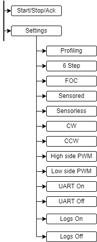

# Settings Menu

## Design

### Actions

|  BLDC                         | LED            | Push-button |
| ----------------------------- | -------------- | ----------- |
| Start                         | Off → On       | Short press |
| Stop                          | On → Off       | Short press |
| Acknowledge fault             | Blinking → Off | Short press |
| Enter settings menu           | 3 blinks       | Long press  |
| Navigate inside settings menu | 1 blink        | Short press |
| Save & exit                   | 4 blinks       | NA          |

**Push-button actions criteria:**
- Short press – TRUE for <1sec
- Long press – TRUE for >3sec
- NA – FALSE for >5sec

### BLDC Settings Menu Flow



### Pseudo Code

```
POS_CONST <- integer value
currPos <- 0
started <- false
Function Loop():
    If started is false and GPIO is false:
        millis <- GetTick()
        While GPIO is false and GetTick() - millis <= 3000ms:
            wait
        If GetTick() - millis < 1000ms
            LED <- On
            started <- true
        Else if HAL_GetTick() - millis >= 3000ms
            LED <- 3 blinks
            wait 200ms
            If GPIO is true:
                while HAL_GetTick() - millis <= 5000ms:
                    If GPIO is false:
                        wait 200ms
                        If GPIO is true:
                            If currPos >= POS_CONST:
                              currPos <- 1
                            Else:
                              currPos <- currPos + 1
                            LED <- 1 blink
                            millis <- GetTick()
                FLASH <- currPos
                LED <- 4 blinks
    If started is true:
        If GPIO is false:
            wait 200ms
            If GPIO is true:
                LED <- Off
                started <- false
```
