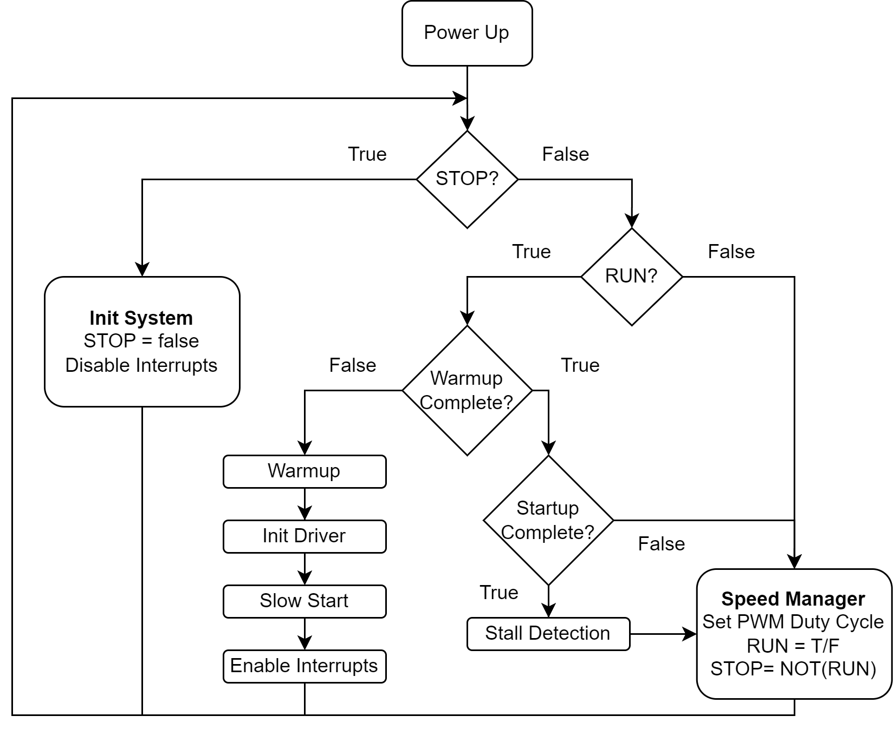

# 6 Step Commutation

## Design

### System Services

#### Init System

- Disable Interrupts, PWM, ADC.
- Load System Service variables (e.g., Timers, Flags) to their default values.
- Load Settings from FLASH memory.
- Adjust peripheral configurations based on the loaded settings.
    - `For Sensorless 1 mode & low-side modulation` - Adjust the input capture polarity to detect falling edges.
- Start ADC.

#### Time Base Manager

- Sets Warmup, Slow Start, Startup, Stall, and Duty timer flags to true every 10 milliseconds.

#### Warm-Up

- Upon completion of warm-up, the motor drivers are enabled, and slow start begins.

#### Start-Up

- Dwell motor within known commutation states until the slow start timer is elapsed.
- Activate interrupts according to the provided settings.
    - `For Sensorless 1 mode` - Enable timer base interrupt.
    - `For Sensored mode,` - Enable timer input capture interrupt.
- If the startup completion flag is not set before startup timer elapsed, then set the stop flag.

#### Stall Control

- If the stall timer has elapsed, activate the stop flag.
- `For Sensorless 1 & 2 mode` - Activate the stop flag if the stall check timer has elapsed and the commutation time exceeds the maximum preset value.

#### Speed Manager

## Interrupts

### Sensorless

### Sensored

## Additional Resources

- [AN1305](https://www.microchip.com/en-us/application-notes/an1305)
- [AN857](https://www.microchip.com/en-us/application-notes/an857)
- [AN957](https://www.microchip.com/en-us/application-notes/an957)
- https://community.st.com/t5/stm32-mcus-motor-control/utility-of-gpio-bemf/td-p/250541
- https://github.com/microchip-pic-avr-solutions
