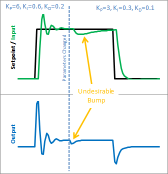

## Improving Classic PID Algorithm

### Classic PID Algorithm

- The classic PID equation can be expressed as

    

- The algorithm derived from the above equation is

    ```
    Input <- Reading from sensor
    Setpoint <- Input desired setpoint
    Kp, Ki, Kd <- Input suitable gains

    COUNTS_PER_SECOND <- Timer counts per second
    PreviousCount <- 0
    ErrorSum <- 0
    PreviousError <- 0

    Function updateOutput():
        CurrentCount <- getTimerCounter()
        DeltaT <- (CurrentCount - PreviousCount) / COUNTS_PER_SECOND
        Error <- SetPoint - Input
        ErrorSum <- ErrorSum + (Error * DeltaT)
        ErrorRate <- (Error - PreviousError) / DeltaT
        Output <- (Kp * Error) + (Ki * ErrorSum) + (Kd * ErrorRate)
        PreviousError <- Error
        PreviousCount <- CurrentCount
        Return Output
    ```

### Improvement 1 - Sample Time

- The classic PID is designed to be called irregularly, leading to two primary challenges:
    - Inconsistent behaviour.
    - Additional computational burden.

- To overcome these challenges, it is important to trigger PID computations at regular time intervals. In other words, the update function is triggered every cycle according to a set sample time.

- The derivative and integral calculations can also be simplified once the PID is being evaluated at a constant interval.

    ```
    Input <- Reading from sensor
    Setpoint <- Input desired setpoint
    Kp, Ki, Kd <- Input suitable gains
    Ki <- Ki * SampleTime;
    Kd <- Kd / SampleTime;

    ErrorSum <- 0
    PreviousError <- 0

    Function updateOutputAtConstantInterval():
        Error <- SetPoint - Input
        ErrorSum <- ErrorSum + Error
        dError <- Error - PreviousError
        Output <- (Kp * Error) + (Ki * ErrorSum) + (Kd * dError)
        PreviousError <- Error
    ```

### Improvement 2 - Derivative on Measurement

- Derivative Kick: When the setpoint suddenly changes, The error signal change rapidly, resulting in a large derivative term in the PID equation, leading to overshoot or undershoot in the output.

    

- This issue can be resolved by applying the following changes to the derivative term.

    

    ```
    ...
    PreviousInput <- 0
    
    Function updateOutputAtConstantInterval():
        ...
        dInput <- Input - PreviousInput
        Output <- (Kp * Error) + (Ki * ErrorSum) - (Kd * dInput)
        PreviousInput <- Input
    ```

- `Note: Implement this change based on the sensitivity of your application.`

### Improvement 3 - Tuning

- The PID controller may become unstable if tuning parameters are adjusted during runtime.

    

    

    This issue arises due to the Integral term of classic PID equation.

    

    Initially, the equation seems good until the Ki value is changed. Then, the new Ki value is applied to the entire error sum accumulated, accidentally impacting the output.

- The solution is to bring the Ki inside the integral instead of having it outside.

    

    ```
    ...
    
    Function updateOutputAtConstantInterval():
        ...
        ErrorSum <- ErrorSum + (Ki * Error)
        ...
        Output <- (Kp * Error) + ErrorSum - (Kd * dInput)
    ```

## Ziegler-Nichols Method for PID Autotuning

- Start by setting the proportional gain (Kp) value to 1 and apply a step response to the reference/trigger signal.

- Record and plot input (feedback) and output values over time.

- Identify peak values and the period from the graph to derive Pu, A, and D values.

    

- Calculate Kp, Ki, and Kd gains using the following formulas.

    

- Use either a basic low-pass filter or a two-trigger signal method to reduce noise in feedback readings.

    

## BLDC Motor Parameters

1. T_max = K_t × I_p

    Where:
    - T_max is the maximum torque in Nm
    - K_t is the torque constant in Nm/A
    - I_p is the peak current in A

2. f = (N × p) / 60

    Where:
    - f is the electrical frequency in Hz
    - N is the speed of the motor in RPM
    - p is the number of pole pairs

3. The electrical frequency (f) is related to the applied voltage (V) and the back EMF constant (K_e) by:

    V = f × K_e = f × K_t

    Since, Back EMF constant (K_e) ≈ Torque constant (K_t) for a BLDC motor.
