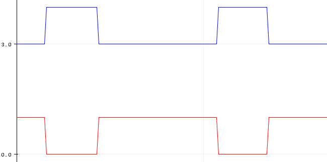
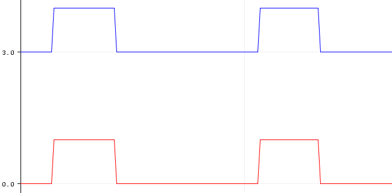

# STM32 PWM Characteristics

### Configuration 1

|                |            |
| -------------- | ---------- |
| OC Mode        | PWM Mode 1 |
| Counter Mode   | Up         |
| Period         | 1000 (1Hz) |
| Pulse          | 300        |
| CH Polarity    | High       |
| CHN Polarity   | High       |
| CH Idle State  | Reset      |
| CHN Idle State | Reset      |

### Configuration 2

|                |            |
| -------------- | ---------- |
| OC Mode        | PWM Mode 1 |
| Counter Mode   | Up         |
| Period         | 1000 (1Hz) |
| Pulse          | 300        |
| CH Polarity    | High       |
| CHN Polarity   | Low        |
| CH Idle State  | Reset      |
| CHN Idle State | Reset      |

### Configuration 3

|                |            |
| -------------- | ---------- |
| OC Mode        | PWM Mode 1 |
| Counter Mode   | Up         |
| Period         | 1000 (1Hz) |
| Pulse          | 300        |
| CH Polarity    | High       |
| CHN Polarity   | High       |
| CH Idle State  | Reset      |
| CHN Idle State | Set        |

`Note: PWM Mode 1: Active high when Counter < Pulse (left-edge alignment). PWM Mode 2: Active low when Counter < Pulse (right-edge alignment).`

### Method to Achieve 100% Duty Cycle

- Setting register CCRx to `<Period> + 1` forces PWM to 100% duty cycle. Setting register CCRx to 0 results in a 0% duty cycle, or you can stop PWM to achieve the same effect.

### Additional Resources

- [STM32 PWM Output with Dead Time Using STM32Cube HAL Platform](https://hasanyavuz.ozderya.net/?p=437)
- [STM32 Advanced Timers Part 2: Dead Time Insertion](https://blog.embeddedexpert.io/?p=2067)
- Maximum Dead Time value = 255 → 1008 / timer_frequency
